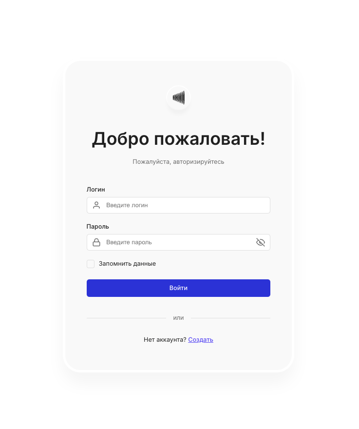
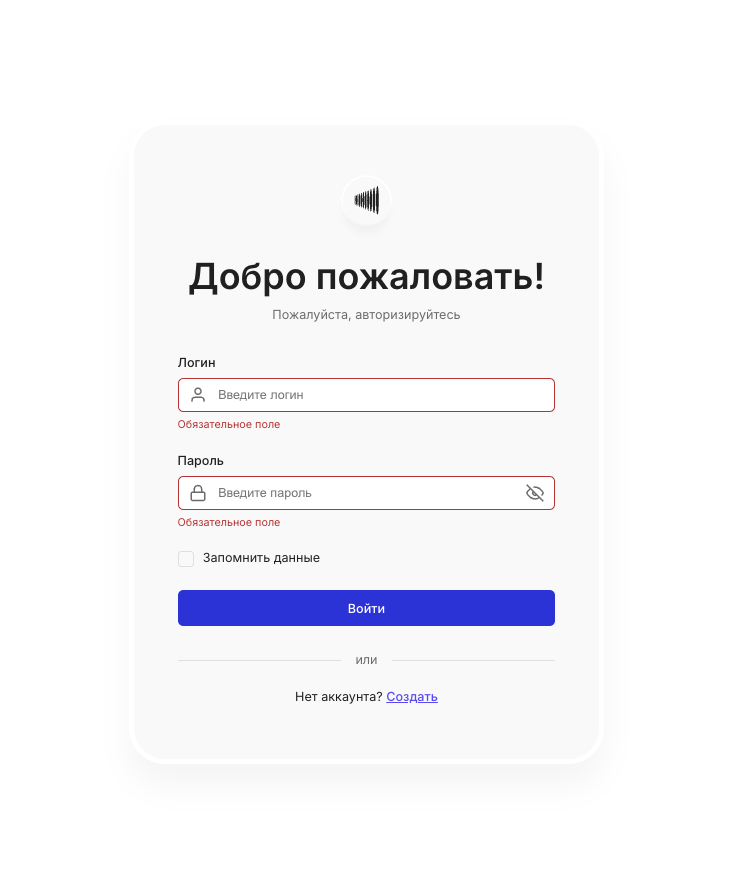
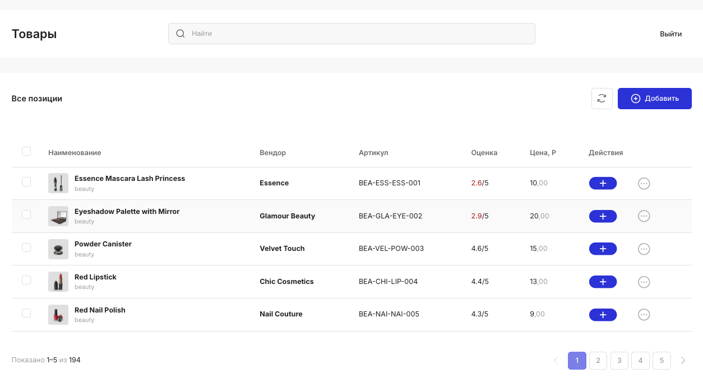
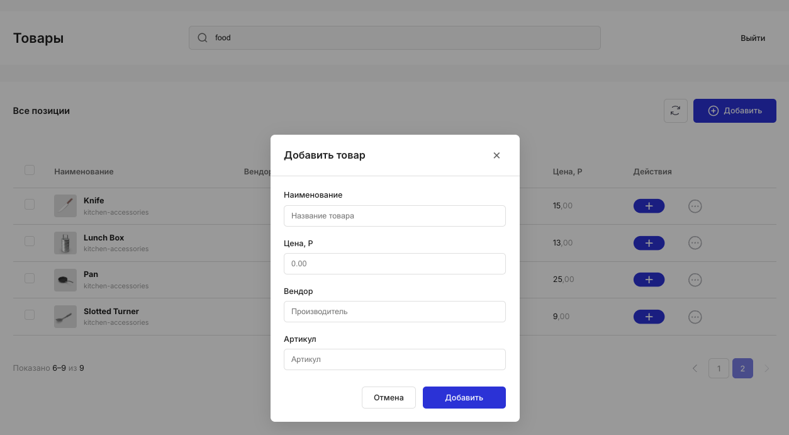

# Каталог товаров интернет-магазина

Вход в аккаунт, список товаров в виде таблицы с поиском и сортировкой, добавление позиций в каталог, пагинация.

## Скриншоты

### Страница входа



### Валидация формы входа



### Каталог товаров



### Добавление товара



## Стек

- **React 18**
- **TypeScript**
- **Vite**
- **React Router**
- **Zustand**
- **CSS Modules**

## Требования

- Node.js 20+
- npm

## Установка и запуск

```bash
npm install
npm run dev
```

Откройте [http://localhost:5173](http://localhost:5173).

## Скрипты

| Команда           | Описание                      |
| ----------------- | ----------------------------- |
| `npm run dev`     | Режим разработки с hot reload |
| `npm run build`   | Production-сборка             |
| `npm run lint`    | Проверка кода (ESLint)        |
| `npm run preview` | Запуск собранного приложения  |

## Функциональность приложения

### Вход

- Форма с полями «Логин» и «Пароль», валидация обязательности заполнения. Ошибки отображаются под полями и общим блоком над формой (в т.ч. при ошибке API).
- Чекбокс «Запомнить данные»: при отмеченном — токен сохраняется в localStorage (сессия переживает закрытие браузера), при снятом — в sessionStorage (сброс при закрытии вкладки).
- После успешного входа — редирект на каталог товаров. При инициализации приложения токен проверяется через API (`/auth/me`); при невалидном токене выполняется выход.

### Каталог товаров

- Загрузка списка с внешнего API. При загрузке отображается прогресс-бар; до первой успешной загрузки — скелетон таблицы (5 строк). При ошибке загрузки показывается сообщение с возможностью закрыть.
- Таблица: колонки «Наименование» (с превью и категорией), «Вендор», «Артикул», «Оценка», «Цена, Р», «Действия». Выбор строк чекбоксами; кнопка «Выбрать все» в шапке таблицы действует только для строк текущей страницы, выбор на других страницах сохраняется.

### Сортировка

- Сортировка по наименованию, вендору, оценке и цене по клику на заголовок колонки (цикл asc → desc). Состояние сортировки хранится в сторе на время сессии.

### Поиск

- Поиск по API с дебаунсом; пагинация (limit/skip). Номер страницы и строка поиска сохраняются в sessionStorage (Zustand persist) и восстанавливаются при возврате на страницу.

### Добавление товара

- Кнопка «Добавить» открывает модальное окно с полями: наименование, цена, вендор, артикул. Валидация полей; при успешном добавлении товар сохраняется в локальный стейт (без отправки на API), показывается Toast «Товар успешно добавлен», модалка закрывается. Закрытие по клику на фон, по кнопке «×» или по клавише Escape.

### Интерфейс

- Рейтинг товара ниже 3 подсвечивается красным.
- Кнопки «Обновить» (сброс поиска и страницы, повторная загрузка) и «Выйти» (сброс токена и сохранённых page/search, редирект на страницу входа).

## Данные / API

- **Товары**: [DummyJSON Products](https://dummyjson.com/docs/products) — список, поиск (`/products/search`), сортировка (query-параметры `sortBy`, `order`). Пагинация через `limit` и `skip`.
- **Авторизация**: [DummyJSON Auth](https://dummyjson.com/docs/auth) — вход через `POST /auth/login`; при старте приложения токен проверяется запросом `GET /auth/me` с заголовком `Authorization: Bearer <token>`.

В режиме разработки запросы к API проксируются через Vite: в [vite.config.ts](vite.config.ts) настроен proxy с `/api/dummyjson` на `https://dummyjson.com`.

## Структура проекта

```
├── index.html
├── src/
│   ├── main.tsx
│   ├── App.tsx
│   ├── index.css           # Глобальные переменные, сброс, skip-link, visually-hidden
│   ├── api/
│   │   ├── config.ts       # API_BASE (dev proxy / production)
│   │   ├── authApi.ts      # login(), getMe()
│   │   └── productsApi.ts  # fetchProducts(), searchProducts()
│   ├── store/
│   │   ├── authStore.ts    # token, init, login, logout (Zustand)
│   │   └── productsStore.ts# Список, пагинация, поиск, сортировка, выбор, persist (page/search)
│   ├── pages/
│   │   ├── LoginPage.tsx
│   │   ├── LoginPage.module.css
│   │   ├── ProductsPage.tsx
│   │   └── ProductsPage.module.css
│   ├── components/
│   │   ├── ProtectedRoute.tsx
│   │   ├── ProtectedRoute.module.css
│   │   ├── Button.tsx
│   │   ├── Button.module.css
│   │   ├── Input.tsx
│   │   ├── Input.module.css
│   │   ├── Checkbox.tsx
│   │   ├── Checkbox.module.css
│   │   ├── ProductsTable.tsx
│   │   ├── ProductsTable.module.css
│   │   ├── AddProductModal.tsx
│   │   ├── AddProductModal.module.css
│   │   ├── Toast.tsx
│   │   ├── Toast.module.css
│   │   ├── ProgressBar.tsx
│   │   ├── ProgressBar.module.css
│   │   └── icons/          # LoginIcons, TableIcons, index
│   ├── hooks/
│   │   └── useDebounce.ts
│   ├── types/
│   │   ├── auth.ts
│   │   ├── product.ts
│   │   ├── components.ts
│   │   └── index.ts
│   └── utils/
│       ├── storage.ts      # Токен (local/session)
│       ├── validation.ts   # Валидация формы добавления товара
│       ├── format.ts       # formatPriceWithParts, formatRating
│       └── dom.ts          # generateDomId
├── screenshots/
│   ├── login.png
│   ├── login-validation.png
│   ├── main-page.png
│   └── modal.png
├── vite.config.ts
├── tsconfig.json
└── package.json
```

## Особенности реализации

- **Семантика и доступность**: разметка с `<main>`, `<section>`, `<nav>`, `<header>`, `<footer>` с использованием ARIA-атрибутов.
- **Стили**: CSS Modules, дизайн-токены в `:root` ([index.css](src/index.css)); переиспользуемые компоненты (Button, Input, Checkbox) и страницы со своими модулями.
- **Состояние**: Zustand; в authStore — токен, init (проверка токена через getMe), login, logout; в productsStore — список товаров, пагинация, поиск, сортировка, выбор строк, локально добавленные товары, persist (sessionStorage) только для номера страницы и строки поиска.
- **Типизация**: строгий TypeScript; типы вынесены в [types/](src/types/) и используются в компонентах и страницах.
